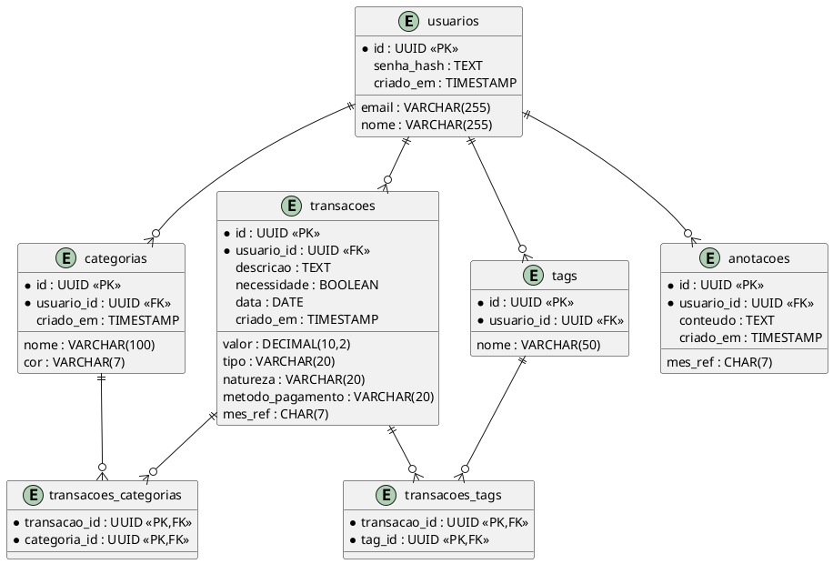

# Diagramas: Entity Relationship (ER)

## Diagrama ER em PlantUML

Copie e cole em: https://www.plantuml.com/plantuml/uml/

---

## Como visualizar

1. Acesse: https://www.plantuml.com/plantuml/uml/
2. Cole o código acima
3. Clique "Submit"
4. Veja o diagrama renderizado

---

## Relacionamentos

- **usuarios → transacoes**: Um usuário registra várias transações
- **usuarios → categorias**: Um usuário cria várias categorias
- **usuarios → tags**: Um usuário cria várias tags
- **usuarios → anotacoes**: Um usuário pode registrar várias anotações por mês
- **transacoes ↔ categorias**: Uma transação pode ter uma ou mais categorias
- **transacoes ↔ tags**: Uma transação pode ter uma ou mais tags

---

## Próximo passo

➡️ [[DIAGRAMAS/sequencia.md]] - Veja os diagramas de sequência
