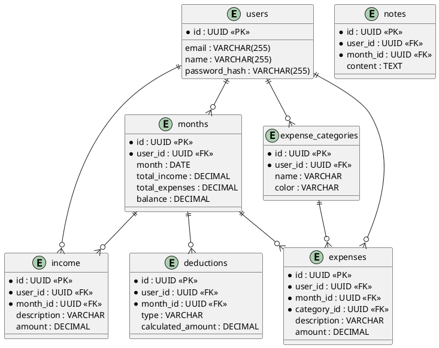

# Diagramas: Entity Relationship (ER)

## Diagrama ER em PlantUML

Copie e cole em: https://www.plantuml.com/plantuml/uml/

---

## Como visualizar

1. Acesse: https://www.plantuml.com/plantuml/uml/
2. Cole o código acima
3. Clique "Submit"
4. Veja o diagrama renderizado

---

## Relacionamentos

- **users → months**: Um usuário tem vários meses
- **users → income**: Um usuário registra várias receitas
- **months → income**: Um mês agrupa várias receitas
- **categories → expenses**: Uma categoria tem várias despesas

---

## Próximo passo

➡️ [[DIAGRAMAS/sequencia.md]] - Veja os diagramas de sequência
